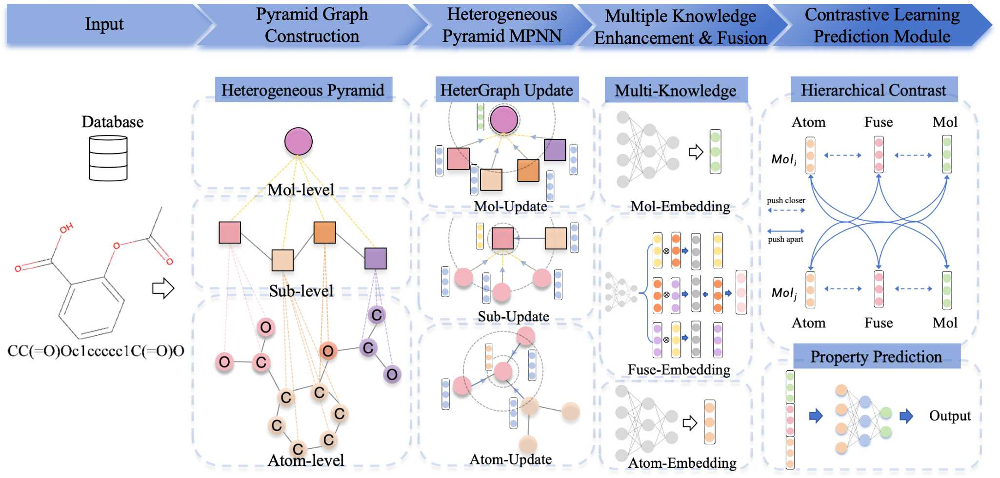

# Multi-knowledge Driven Heterogeneous Pyramid Model for Enhancing Molecular Property Prediction
## Introduction
PryMol is a novel heterogeneous pyramid framework for molecular property prediction, which contains three main components: Heterogeneous Pyramid Message Passing Neural Network, Multiple Knowledge Enhancement and Fusion Module, and Hierarchical Contrastive Learning Strategy.

<div align=center>

</div>

## Preparation
Clone this repository by " https://github.com/lyj363636/PyrMol.git"
PyrMol is implemented in Pytorch and execute on a one NVIDIA Tesla a100 (40G) GPU. The node and edge features are processed by the open-source package RDKit.

## Environment
PyrMol primarily relies on the following Python pcakages:
- python=3.12.11
- cuda=12.4
- torch=2.4.0
- numpy=1.26.4
- pandas=2.3.1
- scipy=1.13.1
- tqdm=4.67.1
- scikit-learn=1.7.1
- dgl=2.4.0
  

In case you want to use conda for your own installation please create a new PyrMol environment.
We showed an example of creating an environment.
```sh
conda create -n PyrMol python=3.12.11
conda activate PyrMol
conda install pytorch==2.4.0 pytorch-cuda=12.4 -c pytorch -c nvidia
conda install scikit-learn=1.7.1 pandas=2.3.1 numpy=1.26.4 scipy=1.13.1 -c conda-forge
```

Or you can use the provided [environment.yml](./environment.yml) to create all the required dependency packages.
```sh
conda env create -f environment.yml
```

## Data
we select ten benchmark molecular datasets for experiments from MolecularNet[23] including Blood-brain barrier permeability
(BBBP), BACE, HIV, ClinTox, Tox21, SIDER, and Toxcast for classification tasks, and ESOL, Freesolv,
and Lipophilicity for regression tasks. These data are saved in Filefold "Datasets"

## Training
Run the codes in PyrMol_demo:

```python
python main_train.py
```

## Models
Our model provided in filefold: Models
